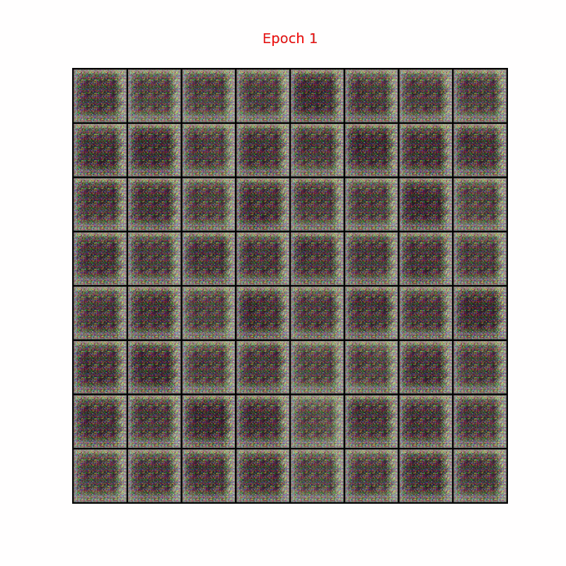
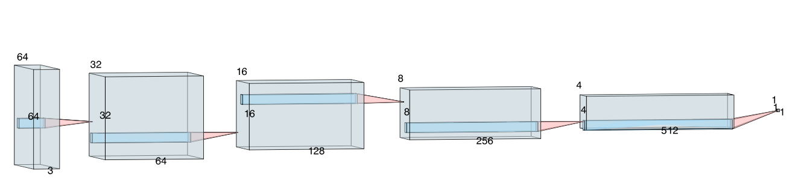
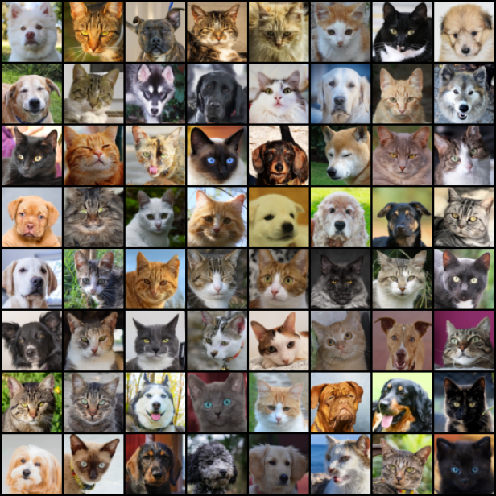
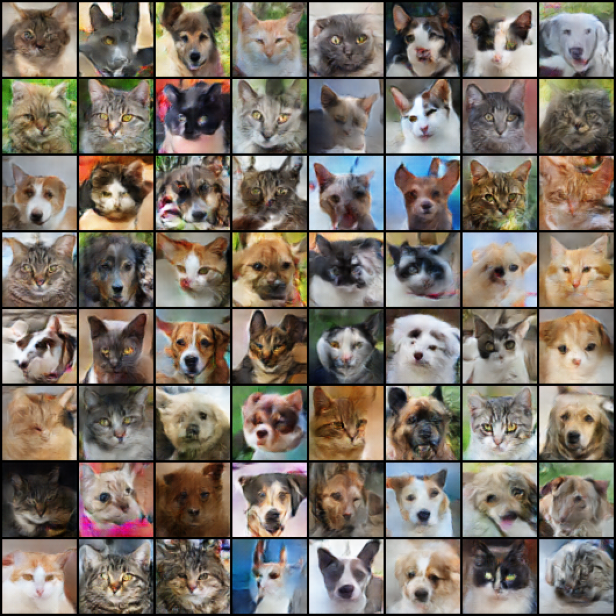

# DCGANs for Pet Image Generation (Dogs & Cats)
In this work, introduce the **Deep Convolutional Generative Adversarial Network (DCGANs)**, originally introduced by Radford et al. (2015), to generate images of pets, specifically cats and dogs.

## Architecture
Architecture guidelines for stable  DCGANs:
* *Replace any pooling layers with strided convolutions (discriminator) and fractional-strided
convolutions (generator)*.
* *Use batchnorm in both the generator and the discriminator (not applying
batchnorm to the generator output layer and the discriminator input layer)*.
* *Remove fully connected hidden layers for deeper architectures.*
* *Use ReLU activation in generator for all layers except for the output, which uses Tanh.*
* *Use LeakyReLU activation in the discriminator for all layers.*
### Generator

### Discriminator

## Dataset 
This project uses the **AFHQ-v2 (Animal Faces-HQ v2)** dataset, which contains high-quality animal face images. The original dataset consists of 3 classes: *cat*, *dog*, and *wild (wild animals)*. Only the cat and dog classes are included, while the wild class is excluded. Each image has a resolution of *512×512*. The training set contains *9,743* images, while the development (dev/validation) set contains *984* images.
<p align="center">
  
</p>

## Experiment
### Setting for training
* **Input normalization**: *scale input images to range [-1,1] (to match the Tanh output the Generator).*
* **Weight initialization**: *initialize weights from a normal distribution ~ N(0, 0.02).*
* **Optimizer**: *Use Adam optimizer with learning_rate=0.0002, beta1 = 0.5 (instead of the default 0.9).*
### Result
<p align="center">
  
</p>

## Instruction
Install required packages:
```
pip install -r requirements.txt
```
Training:
```
python train.py
```
Generate new images:
```
python generate.py --num_images 64
```
## References
[1] **Alec Radford**,  **Luke Metz**, **Soumith Chintala** (2016). *Unsupervised representation learning with deep convolutional generative adversarial networks*. [[arXiv]](https://arxiv.org/pdf/1511.06434)\
[2] **Ian J. Goodfellow**, **Jean Pouget-Abadie**, **Mehdi Mirza**, **Bing Xu**, **David Warde-Farley**, **Sherjil Ozair**, **Aaron Courville**, **Yoshua Bengio**. *Generative Adversarial Networks*. [[arXiv]](https://arxiv.org/pdf/1406.2661)\
[3] **Natsu6767**. *DCGAN-PyTorch*. [[Github]](https://github.com/Natsu6767/DCGAN-PyTorch/tree/master)\
[4] **Yunjey Choi**, **Youngjung Uh**, **Jaejun Yoo**, **Jung-Woo Ha**. *Animal Faces-HQ v2*. [[Dataset]](https://www.dropbox.com/scl/fi/0aha0j1yvhjdnr1r86u0g/afhq_v2.zip?rlkey=ji6v8s9tkma1vg87bwowi9v1e&e=2&dl=0)